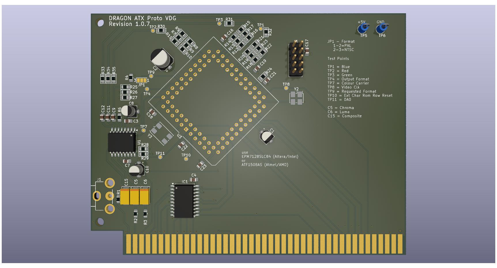

# Dragon 32 ATX Prototype VDG

This repository contains the KiCad project files
to produce the VDG component board for my
ATX Prototype backplane.

This design requires the ATX backplane board in order 
to operate
See https://github.com/jimbro1000/DragonATXProto

## Notes

Revision 1 includes a more modern RGB fed modulator
design that removes a significant problem in the 
form of the old LM1889 modulator. The board also
provides the mounting points for the various mezzanine
boards that have been previously developed. If the
mezzanine option is to be used the rest of the card
should be left unpopulated

This design has been completed using KiCad 9. Earlier
versions of KiCad are not compatible
