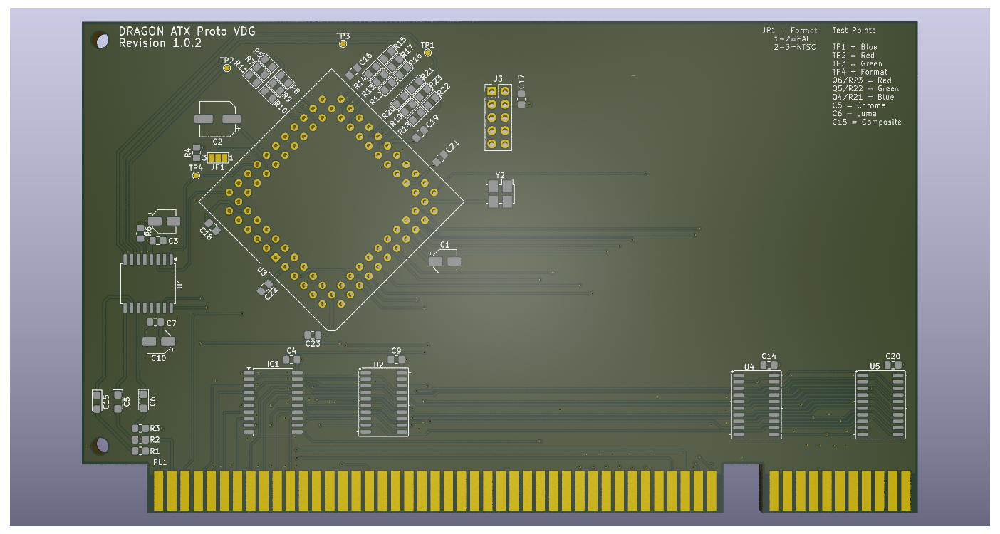

# Dragon 32 ATX Prototype VDG

This repository contains the KiCad project files
to produce the VDG component board for my
ATX Prototype backplane.

This design requires the ATX backplane board in order 
to operate
See https://github.com/jimbro1000/DragonATXProto

## Notes

Revision 1 includes a more modern RGB fed modulator
design that removes a significant problem in the 
form of the old LM1889 modulator. The board also
provides the mounting points for the various mezzanine
boards that have been previously developed. If the
mezzanine option is to be used the rest of the card
should be left unpopulated

This design has been completed using KiCad 9. Earlier
versions of KiCad are not compatible

## Theory of Operation - Video conversion

The video output of the 6847 is a form of YPrPb that
encodes the green channel data over all three of the
outputs.

To generate the RGB signal required for the AD724/725
video encoder some maths needs to be applied to
convert the YPrPb into the appropriate format.

The maths requires 5 values to be generated

Yn - the inverse signal of Y
B-Y - the inverse of Pb
Y-B - Pb
R-Y - the inverse of Pr
Y-R - Pr

Adding Yn to R-Y produces R
Adding Yn to Y-R and Y-B produces G
Adding Yn to B-Y produces B

All of the sums need weighting to make sure the results
are in some form of balance:

R = 2Yn + 2.7(R-Y)
G = 2Yn + 6.8(Y-B) + 4.7(Y-R)
B = 3Yn + 2(R-Y)

Further provision for balancing the channels is made
through a potentiometer on each channel and the result
is then normalised to provide the inputs to the AD724

## Theory of Operation - Format conversion

The 6847 video generator was designed to produce a 
video signal in NTSC format. It has no external controls
to change the format, thus in order to produce a PAL
format some cheating is required in the form of padding

The native NTSC signal is produced at a 60Hz frame rate,
while PAL requires 50Hz. In proportion the PAL video
frame has extra lines (625 vs 525), this results in near
identical lines per second between the formats (but not 
quite identical, just within tolerance).

In terms of raw refresh rate though the PAL signal 
requires an additional 100 lines of video signal are 
produced. This is achieved by suspending the video clock
for the 6847 and synthesizing 50 lines of blank video in
the upper and lower margins of the display.

This is not the end of the story though - a more fundamental
difference between NTSC and PAL is how colour information
is encoded. NTSC provides no automatic correction for any
phase errors in the signal while PAL using phase alternation
(hence the name PAL). Producing a PAL signal from NTSC 
requires the colour phase to be reversed on each consecutive
line.

The original PAL padding circuitry this replaces used a
LM1889 encoder for encoding the colour signal onto the
carrier frequency but with the AD724 and AD725 encoders
this is performed automatically.

The circuit design retains the necessary logic for
artificially producing the alternating signal but does
not utilise it.